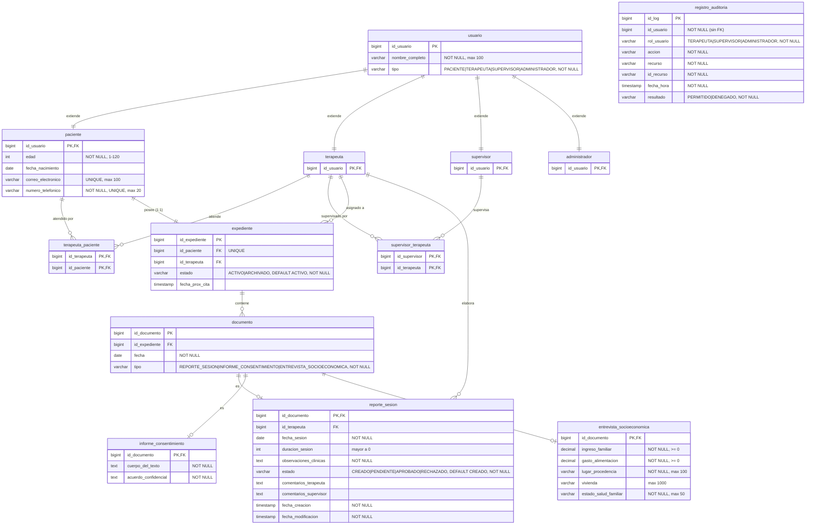

# Diseño de la Base de Datos Relacional

## 1. Estrategia de Modelado

### 1.1 Jerarquía de Usuario

Las clases `Paciente`, `Terapeuta`, `Supervisor` y `Administrador` heredan de `Usuario`. Se aplica la estrategia **Joined Table (una tabla por subclase)**:

- La tabla `usuario` almacena los atributos comunes (`id_usuario`, `nombre_completo`, `tipo`).
- Cada subclase tiene su propia tabla cuya clave primaria es también la clave foránea hacia `usuario`.
- Esta estrategia evita columnas nulas masivas (problema de Single Table) y centraliza la identidad del usuario en un único punto de referencia para las FKs del resto del sistema.

### 1.2 Jerarquía de Documento

Las clases `ReporteSesion`, `InformeConsentimiento` y `EntrevistaSocioeconomica` heredan de `Documento`. Se aplica igualmente la estrategia **Joined Table**:

- La tabla `documento` almacena `id_documento`, `id_expediente`, `fecha` y el discriminador `tipo`.
- Cada subtipo tiene su propia tabla que extiende `documento` con sus atributos específicos.
- La columna `tipo` en `documento` actúa como discriminador y permite conocer a qué subtabla unir sin necesidad de consultar las tres.

---

## 2. Diagrama Entidad-Relación



---

## 3. Esquema DDL SQL

```sql
-- ============================================================
-- ESQUEMA RELACIONAL — Sistema de Expedientes Clínicos
-- Estrategia de herencia: Joined Table (una tabla por subclase)
-- Motor objetivo: PostgreSQL 14+
-- ============================================================


-- ----------------------------------------------------------
-- 1. JERARQUÍA DE USUARIO
-- ----------------------------------------------------------

CREATE TABLE usuario (
    id_usuario      BIGINT       NOT NULL GENERATED ALWAYS AS IDENTITY,
    nombre_completo VARCHAR(100) NOT NULL,
    tipo            VARCHAR(20)  NOT NULL CHECK (tipo IN ('PACIENTE','TERAPEUTA','SUPERVISOR','ADMINISTRADOR')),
    CONSTRAINT pk_usuario PRIMARY KEY (id_usuario)
);

CREATE TABLE paciente (
    id_usuario         BIGINT       NOT NULL,
    edad               INT          NOT NULL,
    fecha_nacimiento   DATE,
    correo_electronico VARCHAR(100),
    numero_telefonico  VARCHAR(20)  NOT NULL,
    CONSTRAINT pk_paciente      PRIMARY KEY (id_usuario),
    CONSTRAINT fk_pac_usuario   FOREIGN KEY (id_usuario) REFERENCES usuario(id_usuario),
    CONSTRAINT chk_edad         CHECK (edad >= 1 AND edad <= 120),
    CONSTRAINT uq_correo        UNIQUE (correo_electronico),
    CONSTRAINT uq_telefono      UNIQUE (numero_telefonico)
);

CREATE TABLE terapeuta (
    id_usuario BIGINT NOT NULL,
    CONSTRAINT pk_terapeuta   PRIMARY KEY (id_usuario),
    CONSTRAINT fk_ter_usuario FOREIGN KEY (id_usuario) REFERENCES usuario(id_usuario)
);

CREATE TABLE supervisor (
    id_usuario BIGINT NOT NULL,
    CONSTRAINT pk_supervisor  PRIMARY KEY (id_usuario),
    CONSTRAINT fk_sup_usuario FOREIGN KEY (id_usuario) REFERENCES usuario(id_usuario)
);

CREATE TABLE administrador (
    id_usuario BIGINT NOT NULL,
    CONSTRAINT pk_administrador PRIMARY KEY (id_usuario),
    CONSTRAINT fk_adm_usuario   FOREIGN KEY (id_usuario) REFERENCES usuario(id_usuario)
);


-- ----------------------------------------------------------
-- 2. TABLAS DE ASOCIACIÓN N:M
-- ----------------------------------------------------------

CREATE TABLE terapeuta_paciente (
    id_terapeuta BIGINT NOT NULL,
    id_paciente  BIGINT NOT NULL,
    CONSTRAINT pk_ter_pac      PRIMARY KEY (id_terapeuta, id_paciente),
    CONSTRAINT fk_tp_terapeuta FOREIGN KEY (id_terapeuta) REFERENCES terapeuta(id_usuario),
    CONSTRAINT fk_tp_paciente  FOREIGN KEY (id_paciente)  REFERENCES paciente(id_usuario)
);

CREATE TABLE supervisor_terapeuta (
    id_supervisor BIGINT NOT NULL,
    id_terapeuta  BIGINT NOT NULL,
    CONSTRAINT pk_sup_ter       PRIMARY KEY (id_supervisor, id_terapeuta),
    CONSTRAINT fk_st_supervisor FOREIGN KEY (id_supervisor) REFERENCES supervisor(id_usuario),
    CONSTRAINT fk_st_terapeuta  FOREIGN KEY (id_terapeuta)  REFERENCES terapeuta(id_usuario)
);


-- ----------------------------------------------------------
-- 3. EXPEDIENTE
-- ----------------------------------------------------------

CREATE TABLE expediente (
    id_expediente   BIGINT      NOT NULL GENERATED ALWAYS AS IDENTITY,
    id_paciente     BIGINT      NOT NULL,
    id_terapeuta    BIGINT      NOT NULL,
    estado          VARCHAR(10) NOT NULL DEFAULT 'ACTIVO' CHECK (estado IN ('ACTIVO','ARCHIVADO')),
    fecha_prox_cita TIMESTAMP,
    CONSTRAINT pk_expediente    PRIMARY KEY (id_expediente),
    CONSTRAINT uq_exp_paciente  UNIQUE (id_paciente),
    CONSTRAINT fk_exp_paciente  FOREIGN KEY (id_paciente)  REFERENCES paciente(id_usuario),
    CONSTRAINT fk_exp_terapeuta FOREIGN KEY (id_terapeuta) REFERENCES terapeuta(id_usuario)
);


-- ----------------------------------------------------------
-- 4. JERARQUÍA DE DOCUMENTO
-- ----------------------------------------------------------

CREATE TABLE documento (
    id_documento  BIGINT      NOT NULL GENERATED ALWAYS AS IDENTITY,
    id_expediente BIGINT      NOT NULL,
    fecha         DATE        NOT NULL,
    tipo          VARCHAR(30) NOT NULL CHECK (tipo IN ('REPORTE_SESION','INFORME_CONSENTIMIENTO','ENTREVISTA_SOCIOECONOMICA')),
    CONSTRAINT pk_documento      PRIMARY KEY (id_documento),
    CONSTRAINT fk_doc_expediente FOREIGN KEY (id_expediente) REFERENCES expediente(id_expediente)
);

CREATE TABLE reporte_sesion (
    id_documento           BIGINT      NOT NULL,
    id_terapeuta           BIGINT      NOT NULL,
    fecha_sesion           DATE        NOT NULL,
    duracion_sesion        INT,
    observaciones_clinicas TEXT        NOT NULL,
    estado                 VARCHAR(10) NOT NULL DEFAULT 'CREADO' CHECK (estado IN ('CREADO','PENDIENTE','APROBADO','RECHAZADO')),
    comentarios_terapeuta  TEXT,
    comentarios_supervisor TEXT,
    fecha_creacion         TIMESTAMP   NOT NULL,
    fecha_modificacion     TIMESTAMP   NOT NULL,
    CONSTRAINT pk_reporte       PRIMARY KEY (id_documento),
    CONSTRAINT fk_rep_documento FOREIGN KEY (id_documento) REFERENCES documento(id_documento),
    CONSTRAINT fk_rep_terapeuta FOREIGN KEY (id_terapeuta) REFERENCES terapeuta(id_usuario),
    CONSTRAINT chk_duracion     CHECK (duracion_sesion IS NULL OR duracion_sesion > 0)
);

CREATE TABLE informe_consentimiento (
    id_documento         BIGINT NOT NULL,
    cuerpo_del_texto     TEXT   NOT NULL,
    acuerdo_confidencial TEXT   NOT NULL,
    CONSTRAINT pk_informe       PRIMARY KEY (id_documento),
    CONSTRAINT fk_inf_documento FOREIGN KEY (id_documento) REFERENCES documento(id_documento)
);

CREATE TABLE entrevista_socioeconomica (
    id_documento          BIGINT        NOT NULL,
    ingreso_familiar      DECIMAL(15,2) NOT NULL,
    gasto_alimentacion    DECIMAL(15,2) NOT NULL,
    lugar_procedencia     VARCHAR(100)  NOT NULL,
    vivienda              VARCHAR(1000),
    estado_salud_familiar VARCHAR(50)   NOT NULL,
    CONSTRAINT pk_entrevista    PRIMARY KEY (id_documento),
    CONSTRAINT fk_ent_documento FOREIGN KEY (id_documento) REFERENCES documento(id_documento),
    CONSTRAINT chk_ingreso      CHECK (ingreso_familiar >= 0),
    CONSTRAINT chk_gasto        CHECK (gasto_alimentacion >= 0)
);


-- ----------------------------------------------------------
-- 5. AUDITORÍA
-- ----------------------------------------------------------

CREATE TABLE registro_auditoria (
    id_log      BIGINT       NOT NULL GENERATED ALWAYS AS IDENTITY,
    id_usuario  BIGINT       NOT NULL,
    rol_usuario VARCHAR(15)  NOT NULL CHECK (rol_usuario IN ('TERAPEUTA','SUPERVISOR','ADMINISTRADOR')),
    accion      VARCHAR(30)  NOT NULL CHECK (accion IN (
                    'CONSULTAR_EXPEDIENTE',
                    'MODIFICAR_EXPEDIENTE',
                    'CAMBIAR_ESTADO_EXPEDIENTE',
                    'REGISTRAR_ENTREVISTA',
                    'REGISTRAR_CONSENTIMIENTO',
                    'REGISTRAR_REPORTE',
                    'MODIFICAR_REPORTE',
                    'ENVIAR_REPORTE',
                    'APROBAR_REPORTE',
                    'RECHAZAR_REPORTE'
                )),
    recurso     VARCHAR(100) NOT NULL,
    id_recurso  VARCHAR(100) NOT NULL,
    fecha_hora  TIMESTAMP    NOT NULL,
    resultado   VARCHAR(10)  NOT NULL CHECK (resultado IN ('PERMITIDO','DENEGADO')),
    CONSTRAINT pk_auditoria PRIMARY KEY (id_log)
    -- Sin FK hacia usuario: preserva registros históricos aunque el usuario sea eliminado del sistema
);


-- ----------------------------------------------------------
-- 6. ÍNDICES
-- ----------------------------------------------------------

-- Expediente: búsqueda de expedientes asignados a un terapeuta
CREATE INDEX idx_exp_terapeuta ON expediente(id_terapeuta);

-- Documento: búsqueda de documentos pertenecientes a un expediente
CREATE INDEX idx_doc_expediente ON documento(id_expediente);

-- ReporteSesion: búsqueda de reportes por terapeuta y filtro por estado (cola de revisión)
CREATE INDEX idx_rep_terapeuta ON reporte_sesion(id_terapeuta);
CREATE INDEX idx_rep_estado    ON reporte_sesion(estado);

-- Auditoría: filtros de consulta definidos en Auditoria.md (por usuario, fecha, acción, recurso)
CREATE INDEX idx_audit_usuario    ON registro_auditoria(id_usuario);
CREATE INDEX idx_audit_fecha      ON registro_auditoria(fecha_hora);
CREATE INDEX idx_audit_accion     ON registro_auditoria(accion);
CREATE INDEX idx_audit_id_recurso ON registro_auditoria(id_recurso);
```

---

## 4. Resumen de Relaciones y Cardinalidades

| Relación                                | Tipo | Mecanismo                           |
|-----------------------------------------|------|-------------------------------------|
| `usuario` → `paciente`                  | 1:1  | FK/PK compartida (Joined Table)     |
| `usuario` → `terapeuta`                 | 1:1  | FK/PK compartida (Joined Table)     |
| `usuario` → `supervisor`               | 1:1  | FK/PK compartida (Joined Table)     |
| `usuario` → `administrador`            | 1:1  | FK/PK compartida (Joined Table)     |
| `terapeuta` ↔ `paciente`               | N:M  | Tabla `terapeuta_paciente`          |
| `supervisor` ↔ `terapeuta`             | N:M  | Tabla `supervisor_terapeuta`        |
| `paciente` → `expediente`              | 1:1  | FK `id_paciente` UNIQUE en expediente |
| `terapeuta` → `expediente`             | 1:N  | FK `id_terapeuta` en expediente     |
| `expediente` → `documento`             | 1:N  | FK `id_expediente` en documento     |
| `documento` → `reporte_sesion`         | 1:0..1 | FK/PK compartida (Joined Table)   |
| `documento` → `informe_consentimiento` | 1:0..1 | FK/PK compartida (Joined Table)   |
| `documento` → `entrevista_socioeconomica` | 1:0..1 | FK/PK compartida (Joined Table) |
| `terapeuta` → `reporte_sesion`         | 1:N  | FK `id_terapeuta` en reporte_sesion |

---

## 5. Notas de Integridad y Seguridad

- **Auditoría sin FK**: `registro_auditoria.id_usuario` no declara `FOREIGN KEY` hacia `usuario` de forma intencional. Esto garantiza que los registros históricos persistan aunque un usuario sea dado de baja del sistema, preservando la trazabilidad requerida por `Auditoria.md`.
- **Operaciones de solo inserción**: la tabla `registro_auditoria` debe estar protegida a nivel de base de datos para permitir únicamente `INSERT`, prohibiendo `UPDATE` y `DELETE` para todos los roles de aplicación.
- **Paciente 1:1 con Expediente**: la restricción `UNIQUE (id_paciente)` en `expediente` garantiza que un paciente tenga como máximo un expediente activo, conforme a la estructura del expediente clínico definida en `Estructura_Del_Expediente_Clínico.md`.
- **CHECK como contrato**: los valores de los campos `estado`, `tipo`, `rol_usuario`, `accion` y `resultado` están restringidos mediante restricciones `CHECK` de PostgreSQL, lo que hace que la base de datos rechace cualquier valor no contemplado en el modelo. Las columnas se declaran como `VARCHAR` para ser compatibles con la estrategia `@Enumerated(EnumType.STRING)` de JPA/Hibernate.
